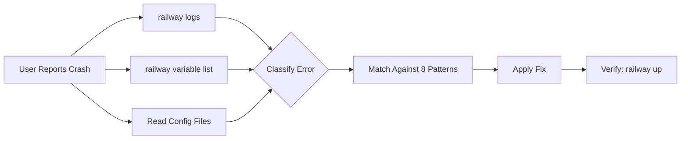

<div align="center">

# 🚂 Railway Deploy Skill

### *Stop guessing why your Railway deploy failed. Let your AI agent diagnose & fix it automatically in seconds.*

[](https://github.com/FMATheNomad/railway-deploy-skill/releases)
[](https://github.com/FMATheNomad/railway-deploy-skill/stargazers)
[](https://github.com/sponsors/FMATheNomad)
[](LICENSE)
[](https://opencode.ai)
[](https://railway.app)

---

# ⭐️ Support This Project ⭐️

**This is a free, open-source skill built by a solo founder. If it saves you from one more deploy-crash-debug cycle, please:**

[](https://github.com/FMATheNomad/railway-deploy-skill/stargazers)
[](https://github.com/sponsors/FMATheNomad)

**Every star & sponsor helps a solo founder keep building free tools for the community.** 🙏

---

> **Stop wasting hours debugging Railway deploys.** This skill gives your AI agent the power to autonomously diagnose and fix Railway deployment crashes — OOM kills, healthcheck failures, database connection errors, and more. One command → agent collects logs, analyzes configs, matches patterns, and applies the fix.

Railway Deploy Skill is an [OpenCode](https://opencode.ai) / [Claude Code](https://claude.ai/code) **agent skill** that supports **FastAPI + Next.js + PostgreSQL** stacks. All CLI commands verified against official `railway --help`.

</div>

---

## 🆚 Why Not Just Debug Manually?

| Feature | Manual Debugging | **Railway Deploy Skill** |
|---------|-----------------|--------------------------|
| ⏱ **Time to fix** | 30 min — 3 hours | **30 seconds** |
| 🔍 **Log analysis** | You scroll through logs | **Agent reads & matches patterns** |
| 📚 **Config checking** | You check each file manually | **Agent reads all files automatically** |
| 🧠 **Pattern recall** | You remember past errors | **8 pre-built patterns** |
| ✅ **CLI accuracy** | You might use wrong flags | **Verified against `railway --help`** |
| 🔓 **Cost** | Your billable time | **Free, MIT licensed** |

## 🆚 vs Railway Built-in AI Agent

Railway's dashboard has a built-in AI agent for deployment diagnosis. Here's how they compare:

| Feature | Railway AI Agent (Dashboard) | **Railway Deploy Skill (Ours)** |
|---------|------------------------------|----------------------------------|
| 💰 **Cost** | **Pay-per-token** (Anthropic rates) | **Free, unlimited** |
| 🔑 **API Key** | Railway account required | **Not needed** |
| 📍 **Where it works** | Only in Railway dashboard | **In your local AI agent (OpenCode, Claude Code, Cursor)** |
| 🔌 **Internet required** | ✅ Yes | **❌ No — works fully offline** |
| 🎯 **Patterns covered** | Generic LLM diagnosis | **8 specific Railway patterns** |
| ⚡ **Response time** | Depends on LLM API | **Instant — local CLI** |
| 🔄 **Auto-fix** | Opens GitHub PR | **Edits config files directly + sets env vars** |
| 🧩 **Customizable** | ❌ No | **✅ Add your own patterns** |
| 🔓 **Vendor lock-in** | Railway-only | **Works with any AI agent, any cloud** |
| 🚫 **Usage limits** | ✅ Hitting limits is common | **❌ No limits, use infinitely** |
| 📜 **License** | Proprietary | **MIT** |

> **Bottom line:** Railway's dashboard AI agent is great for quick diagnosis when you're already in the dashboard — but it's **paid per-token, only works online, and can't be customized**. This skill is **free, works offline in your local AI agent, covers 8 specific Railway failure patterns, and you can add more**. Use both — dashboard agent for quick checks, this skill for deep, automated fixes without leaving your editor or hitting token limits.

---

## ✨ Features

| Feature | Description |
|---------|-------------|
| **🤖 Fully Autonomous** | Agent collects logs, checks env vars, reads configs — no manual input |
| **🔍 8 Failure Patterns** | From OOM kills to healthcheck timeouts |
| **⚡ One-Command Fix** | Say "deploy crash" — agent handles the rest |
| **🛠 Stack-Specific** | FastAPI, Next.js, PostgreSQL, Docker, Railpack |
| **📚 CLI-Accurate** | All Railway CLI commands verified against official `railway --help` |
| **🔓 Open Source** | MIT licensed. Free forever. Built by a solo founder. |

## 🚂 Diagnosed Patterns

| # | Pattern | Error Signature | Fix |
|---|---------|----------------|-----|
| A | **Build OOM** | `Killed`, `exit 137`, `Out of memory` | Reduce memory, `output: "standalone"` |
| B | **No Start Command** | `No start command could be found` | Set in railway.json or settings |
| C | **Port Binding** | `port already in use`, `service unavailable` | Use `$PORT` env var |
| D | **Database Connection** | `ECONNREFUSED`, `timeout` | Check DATABASE_URL, reference vars |
| E | **Healthcheck Failure** | `failed with service unavailable` | Add `/health`, allow `healthcheck.railway.app` |
| F | **Python Dependencies** | `ModuleNotFoundError`, `pip fails` | Pin versions, add apt packages |
| G | **Auto-Deploy Failure** | Push triggers but deploy fails | Check railway.json, watch patterns |
| H | **Monorepo Issues** | Wrong service deploys | Set root directory, absolute paths |

## 📦 Installation

### One-Click (Recommended)

```bash
npx skills add FMATheNomad/railway-deploy-skill@railway-deploy -g -y
```

### Manual — OpenCode

```bash
mkdir -p ~/.config/opencode/skills/railway-deploy
curl -o ~/.config/opencode/skills/railway-deploy/SKILL.md \
  https://raw.githubusercontent.com/FMATheNomad/railway-deploy-skill/main/skills/railway-deploy/SKILL.md
```

### Manual — Claude Code / Cursor / Others

```bash
mkdir -p ~/.agents/skills/railway-deploy
curl -o ~/.agents/skills/railway-deploy/SKILL.md \
  https://raw.githubusercontent.com/FMATheNomad/railway-deploy-skill/main/skills/railway-deploy/SKILL.md
```

### Prerequisites

- [Railway CLI](https://docs.railway.app/cli) installed & authenticated → `railway login`
- Project linked → `railway link`
- Your agent of choice (OpenCode, Claude Code, Cursor, etc.)

## 🚀 Usage

Start a session with your AI agent and say:

> *"Railway deploy saya crash, diagnosa pakai railway-deploy skill"*

Or be more specific:

> *"Build gagal dengan exit code 137 — cek memory issue"*
> *"Auto-deploy error setelah git push"*
> *"FastAPI app deploy sukses tapi healthcheck gagal"*
> *"Database connection refused setelah deploy"*

### What Happens Automatically



### Example Session

```bash
# Agent runs these automatically:
$ railway logs --lines 100
$ railway logs --build --lines 50
$ railway variable list --kv
$ railway status

# Agent reads project files:
# → package.json, railway.json, Dockerfile, next.config.ts

# Agent identifies pattern:
# → Pattern A: Build OOM (exit code 137)

# Agent applies fix:
# → Adds output: "standalone" to next.config.ts
# → railway variable set NODE_OPTIONS=--max-old-space-size=2048

# Agent verifies:
$ railway up
$ railway logs --lines 30
$ railway logs --build --lines 20
```

## 🛠 Supported Stack

| Technology | Status | Notes |
|------------|--------|-------|
| **Next.js** | ✅ | Requires `output: "standalone"` |
| **FastAPI** | ✅ | Tested with uvicorn & hypercorn |
| **PostgreSQL** | ✅ | Railway plugin & external |
| **Docker** | ✅ | Multi-stage build, shell form env vars |
| **Railpack** | ✅ | Default Railway builder |
| **Python 3.11+** | ✅ | pip, requirements.txt |
| **TypeScript / JavaScript** | ✅ | npm, yarn, pnpm, bun |
| **Express / Nest.js** | ✅ | Works with Node.js start commands |
| **Django / Flask** | ✅ | Works with Python start commands |

## 📋 Railway CLI Commands (Verified)

All commands verified against official `railway --help` output:

```bash
railway logs --lines 100              # View last 100 log lines
railway logs --build                  # Build logs only
railway logs --http                   # HTTP request logs
railway logs --filter "@level:error"  # Filter by error level
railway variable list --kv            # List env vars in KEY=VALUE format
railway variable set KEY=VALUE        # Set environment variable
railway up --detach                   # Deploy in background
railway redeploy -y                   # Redeploy without confirmation
railway restart -y                    # Restart without rebuilding
railway deployment list --json        # List all deployments
railway service status                # Check service health
railway connect postgres              # Open psql shell
```

## 🗺 Roadmap

- [ ] **Pattern I: Docker build fails** — native module compilation errors
- [ ] **Pattern J: Redis connection** — common Redis integration issues
- [ ] **Pattern K: Cron job failures** — scheduled task debugging
- [ ] **Auto PR creation** — agent creates PR with fix
- [ ] **Slack/Discord webhook** — notify on deploy failure
- [ ] **Railway MCP server** — direct API integration without CLI
- [ ] **Support for more frameworks** — Django, Remix, Nuxt, Laravel

## 🤝 Contributing

Found a missing pattern? See [CONTRIBUTING.md](CONTRIBUTING.md) for how to add it.

## 📚 References

- [Railway Documentation](https://docs.railway.app)
- [Railway CLI Reference](https://docs.railway.app/cli)
- [Railway Config as Code](https://docs.railway.app/config-as-code)
- [Railway Troubleshooting Guides](https://docs.railway.app/deployments/troubleshooting)
- [OpenCode Skills](https://opencode.ai/docs/skills)
- [skills.sh](https://skills.sh)

---

<div align="center">

## ⭐️ Support the Project ⭐️

**Built by a solo founder who got tired of debugging Railway deploys manually.**  
If this skill saves you time, please support it — every bit counts:

[](https://github.com/FMATheNomad/railway-deploy-skill/stargazers)
[](https://github.com/sponsors/FMATheNomad)
[](https://x.com/intent/tweet?text=🚂%20Stop%20guessing%20why%20your%20@Railway%20deploy%20failed.%20Let%20your%20AI%20agent%20diagnose%20%26%20fix%20it%20automatically.%20OOM%2C%20healthcheck%2C%20DB%20errors%20%E2%80%94%20all%20covered.%20Free%20%26%20open%20source.%20%F0%9F%94%AC&url=https://github.com/FMATheNomad/railway-deploy-skill)

---

*Ship faster. Crash less. Deploy with confidence.*  
*Free for everyone. MIT licensed.*

[](https://fmasoftwarelabs.up.railway.app)
[](https://x.com/fmathenomad)
[](https://github.com/FMATheNomad)

</div>
