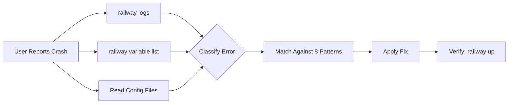

<div align="center">

# 🚂 Railway Deploy Skill

### *Autonomous deployment diagnosis & fix for AI coding agents*

[](https://github.com/FMATheNomad/railway-deploy-skill/releases)
[](https://github.com/FMATheNomad/railway-deploy-skill/stargazers)
[](LICENSE)
[](https://opencode.ai)
[](https://railway.app)
[](CONTRIBUTING.md)
[](https://github.com/sponsors/FMATheNomad)

**[Install](#-installation) • [Usage](#-usage) • [Patterns](#-diagnosed-patterns) • [Contributing](CONTRIBUTING.md) • [Sponsor](https://github.com/sponsors/FMATheNomad)**

---

> **Stop guessing why your Railway deploy failed. Let your AI agent diagnose & fix it automatically.**

Railway Deploy Skill is an [OpenCode](https://opencode.ai) / [Claude Code](https://claude.ai/code) **agent skill** that autonomously diagnoses and fixes Railway deployment crashes for **FastAPI + Next.js + PostgreSQL** stacks. When your deploy fails, your agent instantly collects logs, matches the error against known patterns, and applies the fix — no context switching, no manual debugging.

</div>

---

## ✨ Features

| Feature | Description |
|---------|-------------|
| **🤖 Fully Autonomous** | Agent collects logs, checks env vars, reads configs — no manual input needed |
| **🔍 8 Failure Patterns** | From OOM kills to healthcheck timeouts, all covered |
| **⚡ One-Command Fix** | Say "deploy crash" — agent handles the rest |
| **🛠 Stack-Specific** | Optimized for FastAPI, Next.js, PostgreSQL, Docker, Railpack |
| **📚 CLI-Accurate** | All Railway CLI commands verified against official `railway --help` |
| **🔓 Open Source** | MIT licensed. Free forever. |

## 🚂 Diagnosed Patterns

| # | Pattern | Error Signature | Fix |
|---|---------|----------------|-----|
| A | **Build OOM** | `Killed`, `exit 137`, `Out of memory` | Reduce memory, `output: "standalone"` |
| B | **No Start Command** | `No start command could be found` | Set in railway.json or settings |
| C | **Port Binding** | `port already in use`, `service unavailable` | Use `$PORT` env var |
| D | **Database Connection** | `ECONNREFUSED`, `timeout` | Check DATABASE_URL, reference vars |
| E | **Healthcheck Failure** | `failed with service unavailable` | Add `/health`, allow `healthcheck.railway.app` |
| F | **Python Dependencies** | `ModuleNotFoundError`, `pip fails` | Pin versions, add apt packages |
| G | **Auto-Deploy Failure** | Push triggers but deploy fails | Check railway.json, watch patterns |
| H | **Monorepo Issues** | Wrong service deploys | Set root directory, absolute paths |

## 📦 Installation

### One-Click (Recommended)

```bash
npx skills add FMATheNomad/railway-deploy-skill@railway-deploy -g -y
```

### Manual — OpenCode

```bash
mkdir -p ~/.config/opencode/skills/railway-deploy
curl -o ~/.config/opencode/skills/railway-deploy/SKILL.md \
  https://raw.githubusercontent.com/FMATheNomad/railway-deploy-skill/main/skills/railway-deploy/SKILL.md
```

### Manual — Claude Code / Cursor / Others

```bash
mkdir -p ~/.agents/skills/railway-deploy
curl -o ~/.agents/skills/railway-deploy/SKILL.md \
  https://raw.githubusercontent.com/FMATheNomad/railway-deploy-skill/main/skills/railway-deploy/SKILL.md
```

### Prerequisites

- [Railway CLI](https://docs.railway.app/cli) installed & authenticated → `railway login`
- Project linked → `railway link`
- Your agent of choice (OpenCode, Claude Code, Cursor, etc.)

## 🚀 Usage

Start a session with your AI agent and say:

> *"Railway deploy saya crash, diagnosa pakai railway-deploy skill"*

Or be more specific:

> *"Build gagal dengan exit code 137 — cek memory issue"*
> *"Auto-deploy error setelah git push"*
> *"FastAPI app deploy sukses tapi healthcheck gagal"*
> *"Database connection refused setelah deploy"*

### What Happens Automatically



### Example Session

```bash
# Agent runs these automatically:
$ railway logs --lines 100
$ railway logs --build --lines 50
$ railway variable list --kv
$ railway status

# Agent reads project files:
# → package.json, railway.json, Dockerfile, next.config.ts

# Agent identifies pattern:
# → Pattern A: Build OOM (exit code 137)

# Agent applies fix:
# → Adds output: "standalone" to next.config.ts
# → railway variable set NODE_OPTIONS=--max-old-space-size=2048

# Agent verifies:
$ railway up
$ railway logs --lines 30
$ railway logs --build --lines 20
```

## 🛠 Supported Stack

| Technology | Status | Notes |
|------------|--------|-------|
| **Next.js** | ✅ | Requires `output: "standalone"` |
| **FastAPI** | ✅ | Tested with uvicorn & hypercorn |
| **PostgreSQL** | ✅ | Railway plugin & external |
| **Docker** | ✅ | Multi-stage build, shell form env vars |
| **Railpack** | ✅ | Default Railway builder |
| **Python 3.11+** | ✅ | pip, requirements.txt |
| **TypeScript / JavaScript** | ✅ | npm, yarn, pnpm, bun |
| **Express / Nest.js** | ✅ | Works with Node.js start commands |
| **Django / Flask** | ✅ | Works with Python start commands |

## 📋 Railway CLI Commands (Verified)

All commands verified against official `railway --help` output:

```bash
railway logs --lines 100              # View last 100 log lines
railway logs --build                  # Build logs only
railway logs --http                   # HTTP request logs
railway logs --filter "@level:error"  # Filter by error level
railway variable list --kv            # List env vars in KEY=VALUE format
railway variable set KEY=VALUE        # Set environment variable
railway up --detach                   # Deploy in background
railway redeploy -y                   # Redeploy without confirmation
railway restart -y                    # Restart without rebuilding
railway deployment list --json        # List all deployments
railway service status                # Check service health
railway connect postgres              # Open psql shell
```

## 📁 Project Structure

```
railway-deploy-skill/
├── .github/
│   ├── workflows/
│   │   └── validate.yml       # CI: validates SKILL.md
│   └── FUNDING.yml            # GitHub Sponsors config
├── skills/
│   └── railway-deploy/
│       └── SKILL.md           # 🧠 The skill (agent instructions)
├── README.md                  # 📖 This file
├── CONTRIBUTING.md            # 🤝 Contribution guide
├── LICENSE                    # 📄 MIT License
└── .gitignore
```

## 🗺 Roadmap

- [ ] **Pattern I: Docker build fails** — native module compilation errors
- [ ] **Pattern J: Redis connection** — common Redis integration issues
- [ ] **Pattern K: Cron job failures** — scheduled task debugging
- [ ] **Auto PR creation** — agent creates PR with fix
- [ ] **Slack/Discord webhook** — notify on deploy failure
- [ ] **Railway MCP server** — direct API integration without CLI
- [ ] **Support for more frameworks** — Django, Remix, Nuxt, Laravel

## 🤝 Contributing

Found a missing pattern? See [CONTRIBUTING.md](CONTRIBUTING.md) for how to add it.

## 💖 Support

If this skill saves you time, consider:

- ⭐ **Starring** the repo
- 🐛 **Reporting** issues
- 🔧 **Submitting** PRs
- ☕ **Sponsoring** via [GitHub Sponsors](https://github.com/sponsors/FMATheNomad)

## 📚 References

- [Railway Documentation](https://docs.railway.app)
- [Railway CLI Reference](https://docs.railway.app/cli)
- [Railway Config as Code](https://docs.railway.app/config-as-code)
- [Railway Troubleshooting Guides](https://docs.railway.app/deployments/troubleshooting)
- [OpenCode Skills](https://opencode.ai/docs/skills)
- [skills.sh](https://skills.sh)

## 📄 License

MIT © [FMA Software Labs](https://fmasoftwarelabs.up.railway.app)

<div align="center">

---

**Built by a solo founder, for solo founders.**  
*Ship faster. Crash less. Deploy with confidence.*

[](https://fmasoftwarelabs.up.railway.app)
[](https://x.com/fmathenomad)
[](https://github.com/FMATheNomad)

</div>
